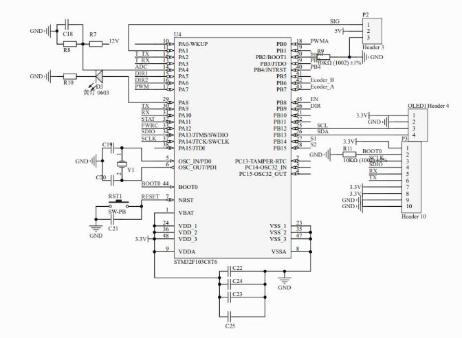
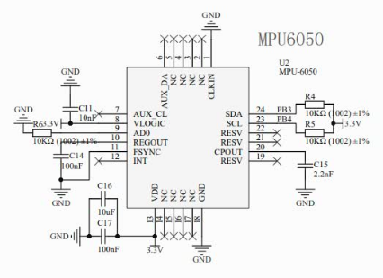

## 自平衡自行车

#### 硬件材料

- TB6612电机驱动芯片（最大输入电压15V，最大输出电流峰值3.2A，平均1.2A，用来控制自行车驱动轮直流电机）
- PT5126AS电机驱动芯片
- SY8120IABC稳压芯片
- STM32F103芯片
- MPU6050（内置DMP滤波器，在stm32中再次利用卡尔曼滤波器进行滤波）
- 万宝至无刷电机（PWM调速，100线编码器AB相双通道输出，控制动量轮保持平衡）
- N20直流无刷电机（控制驱动轮进行纵向运动）
- 树莓派
- 小觅摄像机

#### 电路原理图

#### 位姿估计

- MPU6050读取三个轴向上的加速度，计算模长记为重力加速度，根据重力永远竖直向下得到自行车的Roll角和Pitch角计算公式如下
  $$
  Roll = \cos^{-1}\frac{\sqrt{x^2+z^2}}{g}\\
  Pitch=\cos^{-1}\frac{\sqrt{y^2+z^2}}{g}
  $$

- Kalman滤波比较简单就不再推导

#### 静态平衡的PID控制

我们采用串级控制的方法，外环为定制控制采用PD控制器输入平衡点，反馈量为小车的Pitch角，输出电机的转速。内环为随动控制采用PI控制器输入为期望的电机转速，反馈量为编码器测得的电机转速，输出PWM波占空比。

对于外环控制

- 比例控制引入回复力
- 微分控制引入阻尼力
- 自行车质量一定，重心越高，比例系数越低，微分系数越大
- 重心位置一定，质量越大，比例系数越高，微分系数越大
- 因为种种原因，自行车的平衡位置不一定在90°，所以我们通过手动调节静态平衡点的方法帮助保持平衡
- 先采用纯比例控制器增大比例系数直至等幅震荡，之后加入微分项帮助其保持平衡。

对于内环控制

- 通过引入积分项使小车能够保持平衡，而非存在稳态误差。
- 对于编码器的实际测得转速，我们采用一阶滤波器进行简单的线性滤波。
- 为了防止电机长时间提留在高转速阶段，我们加入了抗积分饱和的操作，对积分进行限幅。

